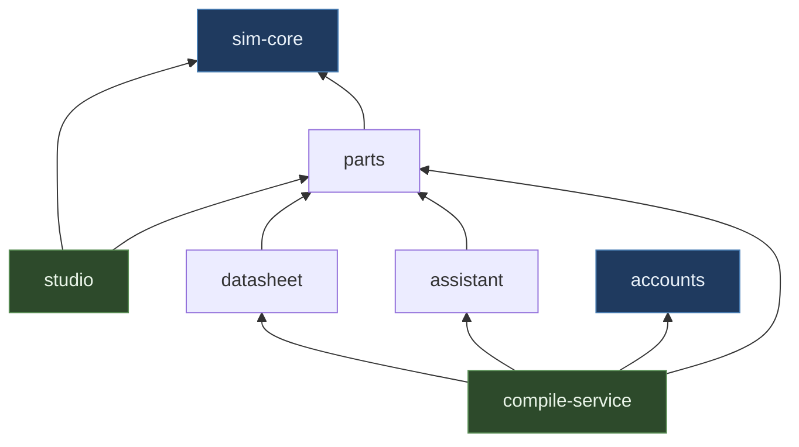

# robo-journey documentation

The code has comments where a decision needs justifying. These pages are the level above that:
what each folder is for, how the pieces fit, and which file to open when you want to change
something.

Start with **[architecture.md](architecture.md)** — it is the map everything else hangs off.

## The pages

| | |
|---|---|
| [architecture.md](architecture.md) | How firmware, electricity and the browser meet. Read this first. |
| [packages/sim-core.md](packages/sim-core.md) | The engine: MNA solver, AVR binding, co-simulation scheduler, faults. No UI, no DOM. |
| [packages/parts.md](packages/parts.md) | What a component *is*. Manifests, the registry, the breadboard, the environment. |
| [apps/studio.md](apps/studio.md) | The browser app: canvas, panels, the simulation worker, the agent. |
| [packages/compile-service.md](packages/compile-service.md) | The only server. Compiles sketches, serves the studio, owns the API. |
| [packages/accounts.md](packages/accounts.md) | Postgres: users, sessions, credits, invites, and the queue for a seat. |
| [packages/assistant.md](packages/assistant.md) | Ask and Agent mode, and the context the model is given. |
| [packages/datasheet.md](packages/datasheet.md) | Turning a PDF into a component the simulator can run. |
| [testing.md](testing.md) | What is tested, how, and what each suite is guarding against. |
| [deployment.md](deployment.md) | Where the running system lives. |

Root documents that are not duplicated here: [../README.md](../README.md) for getting it running
locally, and [../DEPLOYMENT.md](../DEPLOYMENT.md) for putting it on a server.

## The repository

```
robo-journey/
├── packages/
│   ├── sim-core/          the simulation engine — no React, no DOM, runs headless in Node
│   ├── parts/             components, boards, projects, and the world sensors respond to
│   ├── compile-service/   Fastify server: compile, auth, projects, assistant, static studio
│   ├── accounts/          Postgres schema and every query that touches it
│   ├── assistant/         Gemini calls, prompt building, pricing
│   └── datasheet/         PDF in, component manifest out
├── apps/
│   └── studio/            the browser app — React, Konva, dockview, Monaco
├── deploy/                install.sh, bootstrap.sh, Caddyfile
├── scripts/               one-off tooling (part photograph sourcing)
├── test/                  containers for the test run
└── docs/                  you are here
```

## Which package depends on which

`sim-core` and `accounts` are the leaves: they depend on nothing of ours. Everything else is built
on top, and the arrows never point back.



Two rules keep this honest, and both are load-bearing:

- **`sim-core` never imports React or touches `window`.** That is what lets the whole engine run
  under Vitest in Node, which is where most of the tests live. A DOM dependency in the solver would
  make every one of them need a browser.
- **`parts` is browser-safe.** The studio imports it directly, so nothing in it may reach for a
  database or an API key. When the agent needed a vocabulary of actions, it went here rather than
  into `assistant`, which holds the Gemini key.
