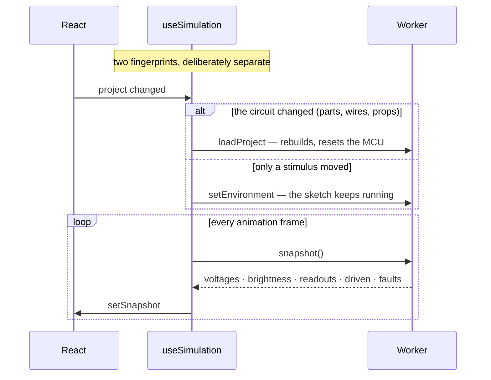
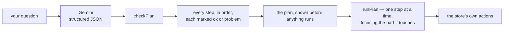

# apps/studio

The browser app. React 19, Konva for the canvas, dockview for the layout, Monaco for the editor,
xterm for the serial monitor, uPlot for the scope.

```
apps/studio/src/
├── main.tsx / App.tsx      routing: the landing page, /app, and the gate around it
├── Landing.tsx             the public page, and LandingDemo.tsx — a real fire alarm, animated
├── Studio.tsx              the dockview shell
├── store.ts                zustand: the project, selection, mode, snapshot, history
├── theme.ts                MUI theme, plus a mutable canvas palette (see below)
├── canvas/
│   ├── Workspace.tsx       the Konva stage — placing, wiring, dragging, rotating
│   ├── shapes.tsx          board, breadboard, resistor, LED, button, generic bodies
│   ├── geometry.ts         terminal positions, rotation about the body centre
│   ├── part-layout.ts      hole detection under a dropped leg
│   ├── sensing.tsx         what each sensor can see, drawn
│   ├── stimulus.tsx        the nine draggable sources
│   └── instruments.tsx     meter faces and the scope screen
├── panels/                 one file per dock panel and dialog
├── sim/
│   ├── worker.ts           the engine, off the main thread
│   ├── protocol.ts         the comlink interface and the snapshot shape
│   ├── useSimulation.ts    the React binding
│   └── useAudio.ts         buzzers, actually audible
├── agent/                  plan.ts (the check), run.ts (the animation), types.ts
├── api.ts / auth.ts        the server, and who you are
└── persistence.ts          localStorage, so a reload does not cost your work
```

## The worker boundary



Two fingerprints because they answer different questions. The circuit fingerprint deliberately
**excludes stimuli and the sketch**: a rebuild resets the processor, so dragging a flame across the
workspace would restart the sketch on every frame — exactly the interaction the flame exists to
enable — and retyping code would rebuild the netlist on every keystroke.

Snapshots are polled, never pushed. A slow frame should cost a frame of staleness, not a queue.

## Two rules the canvas is built on

**React context does not cross the Konva `Stage` boundary.** Shapes cannot read the MUI theme, which
is why `theme.ts` exports a *mutable* `canvas` palette updated by `applyCanvasPalette(mode)` before
a render. It looks like a global because it has to be one.

**Parts rotate about their body centre**, in both `geometry.ts` and the Konva group. The two
agreeing is what keeps a wire attached to a leg after a part is turned; when they disagreed, parts
swung away from their own wires.

## The agent

Ask mode answers. Agent mode edits the circuit and the code. A language model proposing changes to
someone's wiring needs something standing in front of it, and that is `agent/plan.ts`.



`checkPlan` walks the actions against a running picture of the project and catches: an unknown part
type, a duplicate id, a part that does not exist, a pin that does not exist, a malformed breadboard
hole, a wire with both ends on one terminal, and a removed part taking its wires with it.

**It never silently drops a bad step.** It marks it, and you see the mark. A plan that reads
perfectly and wires D13 to a pin that is not there is the failure that matters — not a refusal.

## Where to start reading

| I want to… | Open |
|---|---|
| change how a part is drawn | `canvas/shapes.tsx`, or `panels/PartPortrait.tsx` for its photograph |
| add a panel | `Studio.tsx` for the layout, then `panels/` |
| change what a click does | `canvas/Workspace.tsx` — `handleStageClick`, `handleDragEnd` |
| add to what the app knows | `store.ts` |
| widen what the agent may do | `agent/plan.ts` **and** its test — the check is the feature |
