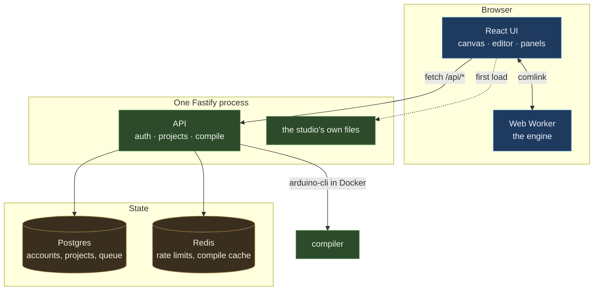
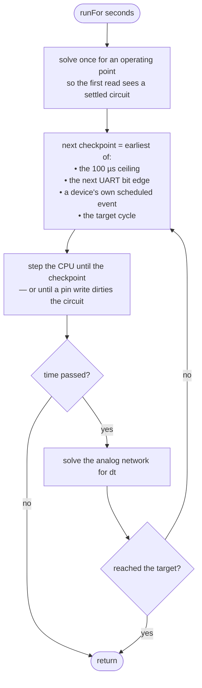
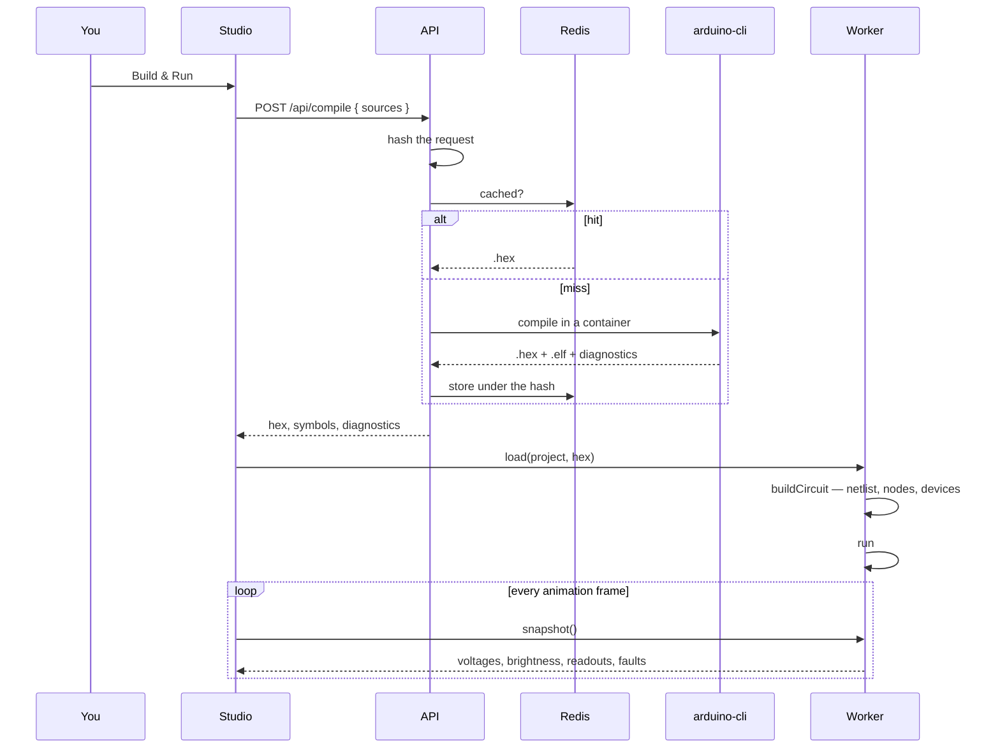
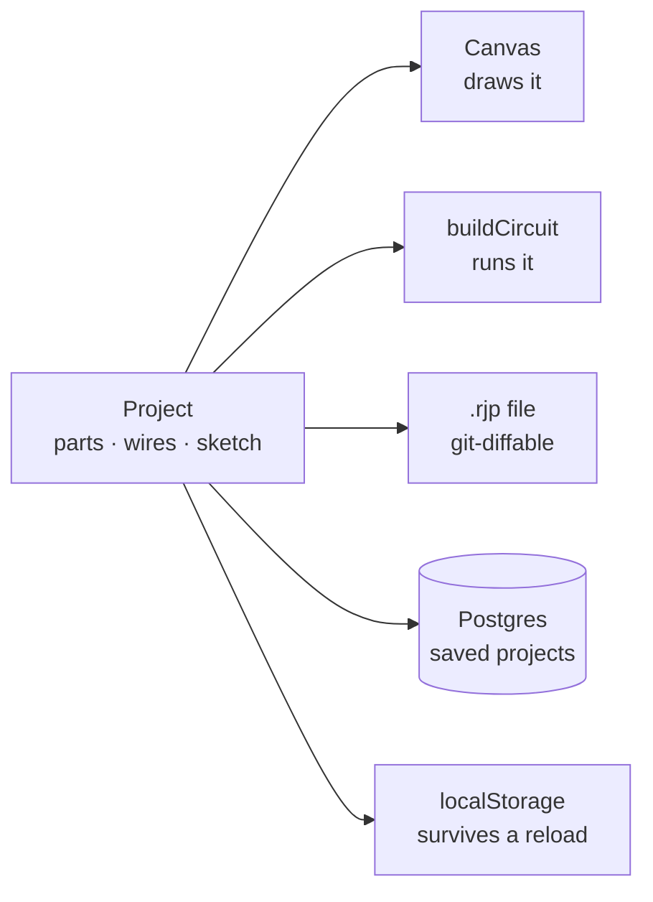

# Architecture

## The problem this shape exists to solve

Two simulators already do half of this. Wokwi runs real compiled firmware on a cycle-accurate AVR
core but does not simulate electricity at all — it will happily light an LED you wired without a
resistor. Tinkercad simulates some electricity but approximates the processor. The faults people
actually hit on a bench are electrical: a missing pull-up, a 3.3 V part on a 5 V pin, a servo
browning out the regulator.

So the whole design is one commitment: **the MCU sees voltages, and the circuit sees pin drive
states.** Real machine code on one side, a real nodal solver on the other, and neither one is
allowed to pretend about the other.

## The three processes

Nothing is distributed. There is one server, one browser tab, and one worker inside it.

The studio and the API are served from **one origin**, which is why there is no CORS configuration
anywhere and no proxy to set up in production.

The engine runs in a **Web Worker**. The UI polls it for a snapshot once per animation frame rather
than the worker pushing updates — a dropped frame should cost a frame of staleness, not a queue of
backed-up messages, and the solver should never be blocked waiting on a renderer.

## The co-simulation loop

Solving the network on every CPU cycle would mean 16 million matrix solves per second. The way out
is the same one Proteus VSM takes: advance the processor freely, and stop only where something
electrical could have changed.

Three things make the checkpoint list what it is, and each was a bug first:

- **The 100 µs ceiling** bounds how stale a node voltage can get.
- **The UART bit edge.** At 9600 baud a bit lasts 104 µs — just over the ceiling — so relying on
  the interval alone samples roughly once per bit, nowhere near enough to decode.
- **Device events.** A rangefinder's echo pulse and a servo's frame schedule their own edges, so a
  sketch calling `pulseIn()` measures a real width rather than one rounded to the tick.

A pin write sets `pinsDirty` and breaks out early, so an output change is never a tick late.

See [packages/sim-core.md](packages/sim-core.md) for the solver itself.

## What happens when you press Build & Run

The cache is keyed on the content of the request, checked **before** the compile rather than after,
because a cold AVR build is about two seconds and most builds are a re-run of the same code.

## Where a project lives

One JSON document is the source of truth for everything on the canvas.

Terminals are the labels printed on the hardware — `uno1:D13`, `bb1:12A` — so a diff of a project
file is legible and a merge conflict is resolvable. A leg in a breadboard hole is recorded as a
wire to that hole, which is what makes "plugged in" a fact in the document rather than a guess
from coordinates.

Measured values are **never** merged back into the project. Snapshots arrive separately and stay
separate; keeping readings out of the document is what makes save, undo and diff sane.

## Conventions that hold everywhere

| | |
|---|---|
| **Millimetres, not pixels** | Part geometry is physical. The canvas multiplies by a scale at the last moment. |
| **2.54 mm is the pitch** | Every through-hole footprint and every breadboard hole. Positions snap to it, which is what makes a leg land in a hole. |
| **Seconds and SI units** | The engine speaks volts, amps, ohms, seconds. Formatting to mA or µs is a UI concern. |
| **Fail loudly** | An unknown part type is reported, not silently dropped. A floating input is flagged, not guessed. |
| **Ports are unusual on purpose** | 28610 service, 28611 studio, 28632 postgres, 28633 redis — so this runs beside other projects. |
