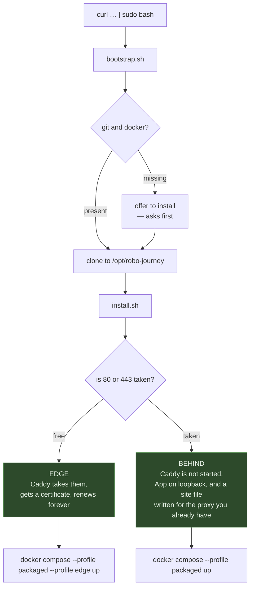
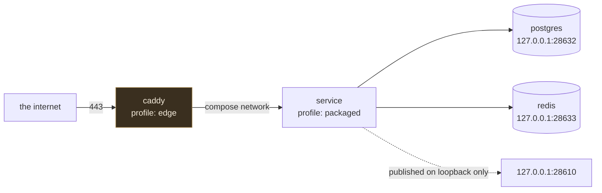

# Deployment

The operator's guide is [../DEPLOYMENT.md](../DEPLOYMENT.md) — flags, what to do about an existing
nginx, what goes in `.env`. This page is the shape of the thing, for people changing it.

```
deploy/
├── bootstrap.sh   curl-able: check git and docker, clone, hand over
├── install.sh     look at the machine, write .env, start the stack
└── Caddyfile      the edge, when this machine's 80 and 443 are free
```

## From nothing to serving



**The whole design is one idea: find out what is already running before changing anything.** A
deploy script that assumes it owns port 443 takes down whatever was serving on it, and the person
who ran it finds out from their users.

## The containers



Two compose profiles. `packaged` is the app and its stores; `edge` adds Caddy and is enabled only
when the installer found 80 and 443 free. Everything except Caddy publishes on **loopback only** —
the app is not reachable from outside except through whatever is out front.

## Certificates

Caddy 2 does Let's Encrypt automatically. Two things make it survive contact with reality:

- **`RJ_ACME_EMAIL`** goes on the ACME account, so expiry warnings reach a person. Blank is allowed
  and means no warnings — a choice the installer asks about rather than an accident.
- **`caddy-data` is a named volume.** Certificates and the account key live there, so a rebuild is
  not a re-issue. Let's Encrypt counts issuances per week, not per deploy, and a redeploy loop
  against a lost volume is how people get rate-limited.

The installer checks the domain resolves to this machine **before** letting Caddy try, because the
alternative is finding out from a failed ACME challenge twenty minutes later — and failures count
against the same weekly limit.

HSTS is set for a year, but only in the edge Caddyfile, where TLS is actually working. Setting it
before a certificate exists locks people out of a site that cannot yet serve them.

## Running it twice

Both scripts are idempotent, and the distinction is deliberate:

- **Secrets already in `.env` are kept, never regenerated.** Regenerating the database password on
  a second run would leave the app unable to open the database it created on the first.
- **Values derived from the domain are rewritten**, so changing the domain actually changes it.
- `bootstrap.sh` fast-forwards the checkout and re-runs the installer — but **stops** rather than
  touching a checkout with uncommitted changes in it.

`--dry-run` decides everything and writes nothing, so it can be read before it is trusted.

## Before exposing this to strangers

Recorded here because it is real and not fixed: **the compile sandbox does not contain a
sketch's `#include`.** A `#include "/etc/hostname"` reads a container file and leaks it through the
compiler diagnostics. Everything else on the list — security headers, authenticating `/info`, a
per-user quota on datasheet extraction, scheduled backups, CI — is ordinary hardening. This one is
the one to close first.
