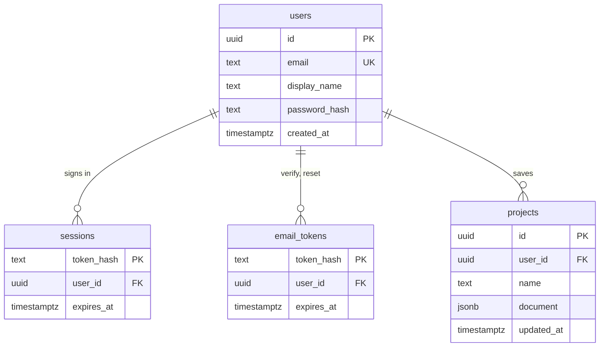
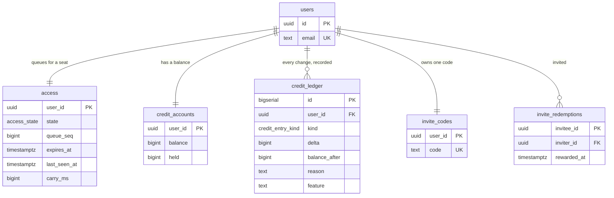

# packages/accounts

Postgres, and every query that touches it. This package depends on nothing else of ours: it is a
leaf, and the service is the only thing that calls it.

```
packages/accounts/src/
├── db.ts              the pool, and running migrations under an advisory lock
├── migrations.ts      versioned, forward-only, each one numbered
├── store.ts           users and sessions
├── passwords.ts       hashing
├── email-tokens.ts    verification and password reset, single-use
├── access.ts          the seat queue
├── credits.ts         balances, holds, and the ledger
├── invites.ts         codes, redemptions, and the reward
├── backfill-credits.ts / import-sqlite.ts   one-off migrations from the old shape
```

## The schema

### Who you are



### What you may do



Sessions store a **hash** of the token, not the token. A dump of this table does not let anyone in.

`projects.document` is the `.rjp` JSON, stored whole. The schema does not know what a wire is and
does not need to; validation belongs to `parseProject`, in one place, on the way in.

## Concurrency

Money and seats are the two places where two requests arriving at the same moment can produce an
answer that is wrong rather than merely late, so both are settled by the database.

- **Credits are a balance plus a ledger.** Every change writes a row with the balance it produced,
  so a disagreement can be read back rather than guessed at.
- **A charge is a hold, then a settle.** The assistant reserves before it calls the model and
  settles after, so a request that fails does not bill.
- **The invite reward is a conditional `UPDATE`.** `WHERE rewarded_at IS NULL` is what makes two
  racing confirmations pay once. `invite_redemptions` has `CHECK (invitee_id <> inviter_id)` so a
  code cannot reward its own owner.
- **Migrations run under an advisory lock.** Three service replicas starting together run them once
  between them.

These were tested against real Postgres with genuinely concurrent requests, not mocks — see
[../testing.md](../testing.md).

## Migrations

Numbered, forward-only, and applied in order. `schema_migrations` records what has run. Adding one
means appending to `migrations.ts`; never edit a migration that has shipped, because someone's
database has already run it.
