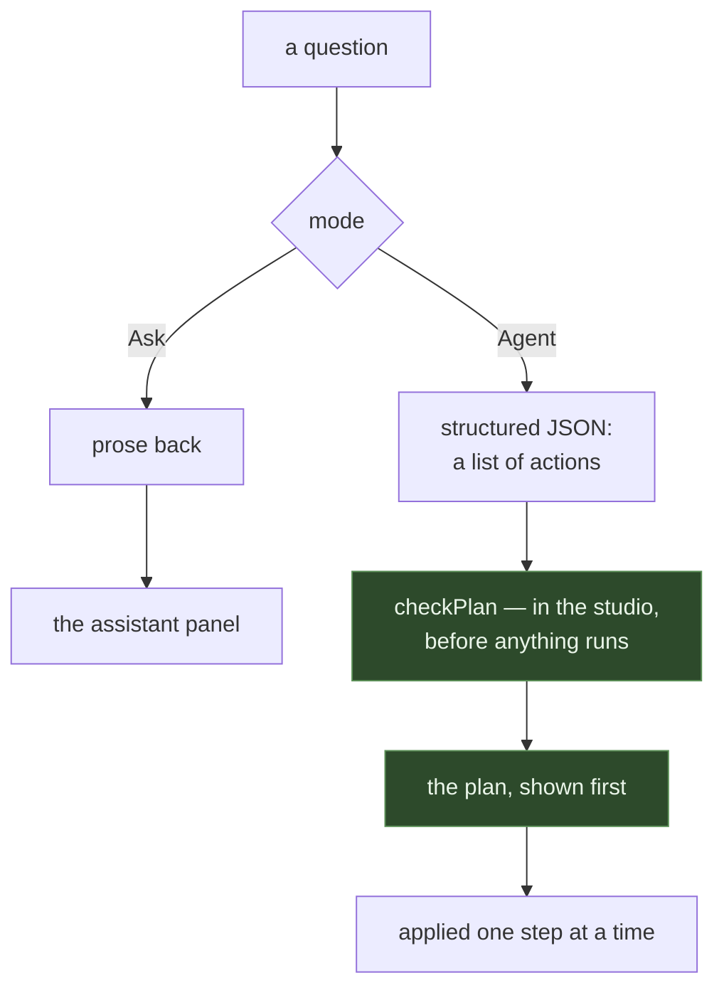

# packages/assistant

The Gemini calls, the context the model is given, and what a request costs. Server-side only —
**the API key must never reach the browser bundle.**

```
packages/assistant/src/
├── chat.ts       the call, both modes
├── context.ts    what the model is told about the circuit
└── pricing.ts    tokens to credits
```

## Two modes



Agent mode asks for `responseMimeType: 'application/json'` so the reply is parsed rather than
scraped out of prose. The action vocabulary lives in **`packages/parts/agent-actions.ts`**, not
here — the studio has to understand it too, and `parts` is the browser-safe package. This one holds
the key.

Nothing the model returns is trusted. The check that stands in front of it is in the studio, and it
is described in [../apps/studio.md](../apps/studio.md).

## Context

The model is given the project as the user has it — parts, wires, the sketch, and the faults
currently showing — because a question about "the LED" is unanswerable without knowing which pin it
is on. Context is built from the same `Project` document everything else reads, so it cannot drift
from what is on screen.

## Credits

A request is charged against the balance in [accounts](accounts.md): held before the call, settled
after. A failed call does not bill. Pricing maps token counts to credits in one place, so changing
a rate does not mean auditing call sites.

Without `GEMINI_API_KEY` the service reports the assistant as unconfigured through
`/assistant/status`, and the panel says so plainly instead of failing at the first question.
