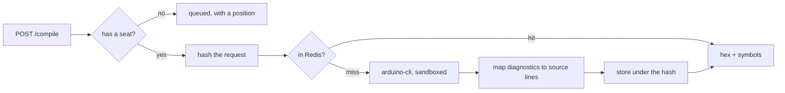
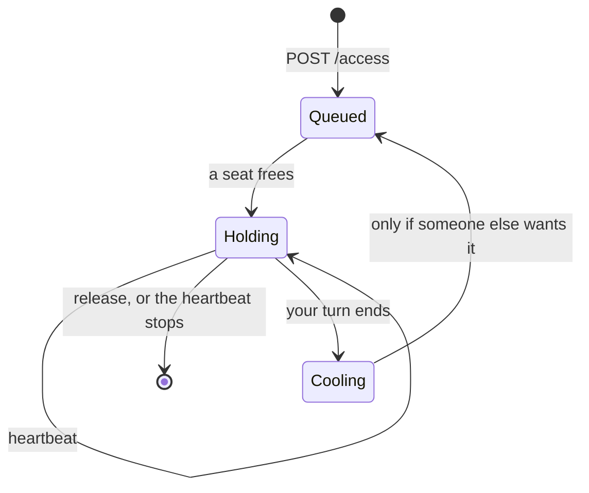

# packages/compile-service

The only server. It compiles sketches, owns the API, and serves the studio's own files — all from
one origin, which is why there is no CORS configuration anywhere and no proxy to configure.

```
packages/compile-service/src/
├── main.ts             the entry point
├── server.ts           the Fastify app, route registration, /compile
├── config.ts           environment parsing, with describeConfig for /info
├── compiler.ts         arduino-cli, in a container or on the host
├── diagnostics.ts      compiler output -> file, line, column, severity
├── auth-routes.ts      register, login, verify, sessions, access, projects
├── assistant-route.ts  chat, credits, invites
├── datasheet-route.ts  PDF extraction
├── session-guard.ts    who is asking, and may they
├── redis.ts            rate limits and the compile cache
├── mailer.ts           SMTP, or the log when it is not configured
└── build-fixtures.ts   compile the .hex files the tests run against
```

## The API

| | | |
|---|---|---|
| `POST` | `/compile` | Sketch in, `.hex` + symbols + diagnostics out. Needs a seat. |
| `POST` | `/auth/register` `/auth/login` `/auth/verify` `/auth/forgot-password` | |
| `POST` | `/auth/logout` `/auth/logout-everywhere` `/auth/resend-verification` | |
| `GET` | `/auth/me` | Who you are, or nothing. |
| `GET` `POST` | `/access` | Ask for a seat, or see where you are in the queue. |
| `POST` | `/access/heartbeat` `/access/release` | Keep a seat, or give it up. |
| `GET` `POST` | `/projects` | List, save. |
| `GET` `PUT` `DELETE` | `/projects/:id` | |
| `POST` | `/assistant/chat` | Ask or Agent mode. Costs credits. |
| `GET` | `/assistant/status` `/credits` `/invites` | |
| `POST` | `/invites/redeem` | |
| `POST` | `/datasheet/extract` | PDF in, component manifest out. |
| `GET` | `/health` `/ready` `/info` | |

`/health` says the process is up. `/ready` says it can reach Postgres and Redis — that is the one a
load balancer should watch, and the one `install.sh` polls.

## Compiling

There is no browser-side AVR compiler. avr-gcc has no mature WASM port, so compilation runs
`arduino-cli` in a container with the same interface either way.



The cache is checked **before** the compile, not after: a cold AVR build takes about two seconds
and most builds are a re-run of the same code. The `.elf` symbol map is what feeds the disassembly
view and the variable inspector.

> **Known gap, not fixed.** The compile sandbox does not stop a sketch reading container files via
> `#include "/etc/hostname"` and leaking them through diagnostics. This is the one to close before
> exposing the compiler to people you do not trust.

## Seats

Only so many people can compile at once. Rather than a fixed timeout, the wait is worked out from
how many people are queuing at the moment a seat is given up.



An outstanding wait is **shortened** if the queue clears, never lengthened. The cooldown exists to
stop one person cycling through the same seat forever, and it only bites when somebody else is
waiting.

## Configuration

Everything comes from the environment; `config.ts` parses it once and fails loudly on a bad value
rather than at the first request that needs it. `deploy/install.sh` writes the file — see
[../deployment.md](../deployment.md).

| | |
|---|---|
| `POSTGRES_*` | Where the database is. Generated on first install and never regenerated. |
| `RJ_PUBLIC_URL` | What the app calls itself in the links it puts in email. |
| `RJ_TRUST_PROXY` | Read the forwarded headers. True whenever anything is in front. |
| `RJ_ACCESS_CAPACITY` | How many people may hold a seat at once. |
| `RJ_SIGNUP_CREDITS` | What a new account starts with. |
| `GEMINI_API_KEY` | The assistant reports itself unconfigured without it. |
| `SMTP_*` | Mail is logged instead of sent when unset. |

The key never reaches the browser. The studio calls `/api/assistant/chat`; the server calls Gemini.
