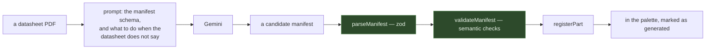

# packages/datasheet

A PDF goes in and a component the simulator can actually run comes out.

```
packages/datasheet/src/
├── prompt.ts     what the model is asked for, and the shape it must answer in
└── extract.ts    the call, then validation
```

## The flow



Two gates, not one. `parseManifest` is structural — zod, the schema in
[parts](parts.md). `validateManifest` is semantic: things a schema cannot express, like a part with
a power pin and no stated maximum supply voltage, or pins that fall outside their own package.

## Saying what it had to guess

The extractor is asked to fill `provenance.unresolved` with every number the datasheet did not
give. That is the most important field it produces.

> "the datasheet gives no output impedance, 50 Ω assumed"

An extraction that silently guesses makes the simulator quietly wrong. One that says which number
it invented tells you exactly what to check. The value is carried onto the part definition and
shown in the UI — on the hover card and in the properties panel — and a generated part is marked as
generated everywhere it appears, so a component nobody has checked is visibly different from one
that ships with the app.

## What is deliberately not here

Parts whose protocol is the whole part — DHT11/22, DS18B20, WS2812 — are not extractable. Their
behaviour is a bit-banged one-wire timing protocol, not a set of numbers on a page, and a manifest
cannot describe it. `builtin-manifests.ts` records the omission and why.
