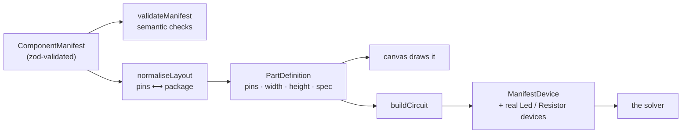
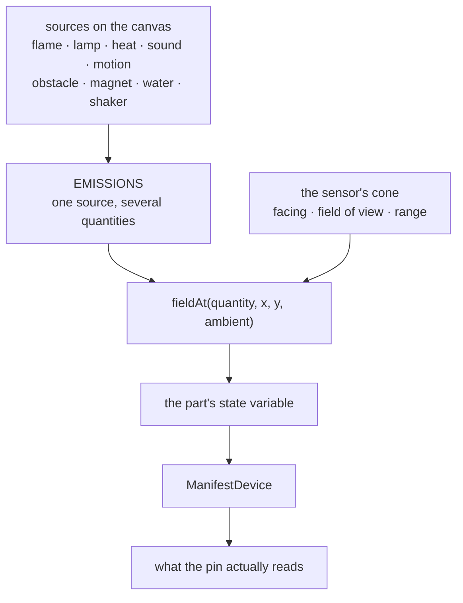

# packages/parts

What a component *is*, what a project *is*, and what the world does to a sensor. Imported directly
by the browser, so **nothing here may reach for a database or an API key**.

```
packages/parts/src/
├── manifest.ts            the schema: a component described as data
├── manifest-runtime.ts    manifest -> a part the canvas and the engine understand
├── manifest-validate.ts   semantic checks a schema cannot express
├── registry.ts            hand-built parts (Uno, breadboards, resistor, LED, button) + lookup
├── build.ts               project -> netlist, nodes, devices
├── project.ts             the .rjp document, its schema, and its invariants
├── environment.ts         light, heat, sound, flame… and how they fall off with distance
├── stimulus.ts            the nine draggable sources
├── instruments.ts         multimeter, ammeter, oscilloscope as placeable parts
├── library.ts             the worked example projects
├── agent-actions.ts       the vocabulary the AI is allowed to act in
└── builtin/               48 component manifests
    ├── kit.ts             the helpers every manifest is built from
    ├── discretes.ts       resistors, caps, diodes, transistors, MOSFETs, op-amps
    ├── sensors.ts         13 — flame, sound, vibration, soil, gas, PIR, ultrasonic…
    ├── actuators.ts       servo, motors, buzzers, relay
    ├── displays.ts        OLED, LCD, seven-segment, LED driver
    ├── power.ts           regulators and batteries
    ├── breakouts.ts       MPU-6050, ADS1115, DS3231, BMP280, ADXL345
    └── logic.ts           74HC595
```

## A component is data, not code

Adding a part usually means adding a manifest, not writing a device. The manifest carries the
package, the pins with an electrical model each, the state the world can drive, the behaviour, the
absolute maximums, and where the numbers came from.



`normaliseLayout` is where geometry is reconciled. Extraction often lays pins out around an origin,
so some come back negative; they are shifted into the positive quadrant and the body grown to
contain them. It also **centres the pin cluster on the body**, rounded to the part's own pitch —
`row()` starts a header one pitch from the left edge, which is right for a transistor and wrong for
an 80 mm LCD backplate. Rounding rather than centring exactly is deliberate: a leg has to land in a
hole, and the part's position is snapped to the grid.

`provenance.unresolved` is the most important field in a manifest. A datasheet extraction that
silently guesses is worse than one that says which number it had to assume — the first makes the
simulator quietly wrong, the second tells you what to check. It surfaces in the UI.

## The environment

Sensors respond to a world made of nine quantities, each with its own combining rule and falloff.



| Quantity | Combines | Falls off |
|---|---|---|
| light, temperature, gas | add | inverse square |
| sound | as sound | inverse square |
| flame, motion, magnet, moisture, vibration | max | square, flat, or cube |
| distance | nearest | not at all |

A flame emits infrared, heat, light **and** smoke, because a real flame is four things at once —
which is why a flame sets off a smoke alarm here without anything being special-cased.

Direction is real: a source outside a sensor's cone or beyond its range is not detected, so turning
a rangefinder away from a wall does something.

The loop closes inside the simulation. A buzzer being driven becomes a sound source at its own
position, so a sound sensor across the bench hears it — pin, through the circuit, across the
workspace, back in through another pin, with nothing special-cased into either part.

## The project document

Plain JSON, zod-validated, deliberately readable.

```json
{
  "version": 1,
  "parts": [{ "id": "uno1", "type": "arduino-uno", "x": 0, "y": 0, "rotation": 0, "props": {} }],
  "wires": [{ "id": "w1", "from": "uno1:D13", "to": "bb1:12A", "color": "#c0392b" }],
  "sketch": [{ "name": "sketch.ino", "contents": "…" }]
}
```

`parseProject` enforces one invariant the schema cannot: **ids are unique**. The engine keys its
devices by part id, so two parts sharing one id share a device and the second silently stops
responding. Documents already written that way are repaired on load rather than rejected.

## Where to start reading

| I want to… | Open |
|---|---|
| add a component | `builtin/kit.ts`, then the nearest neighbour in `builtin/` |
| know why a sensor reads what it reads | `environment.ts` |
| change the breadboard | `../sim-core/src/netlist/breadboard.ts` |
| add an example project | `library.ts` |
| widen what the agent may do | `agent-actions.ts` — and read [../apps/studio.md](../apps/studio.md) on the check that stands in front of it |
