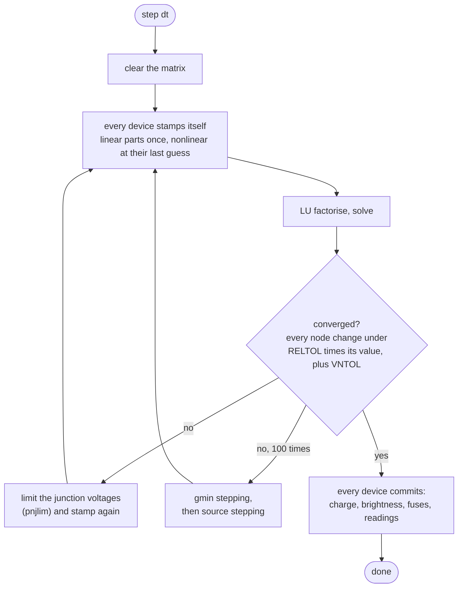

# packages/sim-core

The engine. Everything electrical, everything to do with the processor, and the loop that joins
them. **No React, no DOM, no `window`** — that constraint is what lets the whole thing run headless
under Vitest, which is where most of the project's tests are.

```
packages/sim-core/src/
├── analog/          the solver
│   ├── mna.ts           modified nodal analysis — the matrix and its stamps
│   ├── lu.ts            in-place LU with partial pivoting, over flat Float64Arrays
│   ├── circuit.ts       Newton-Raphson, timestepping, device orchestration
│   ├── devices.ts       resistor, capacitor, inductor, diode, LED, BJT, MOSFET, sources
│   └── constants.ts     tolerances and physical constants, SPICE convention
├── mcu/             the processor
│   ├── atmega328p.ts    avr8js wiring: CPU, timers, ADC, USART, SPI, TWI
│   ├── pin-model.ts     a pin as a stamp — the fidelity crux, see below
│   ├── pin-map.ts       D0..D13 / A0..A5 to ports and bits
│   ├── usart-tx.ts      bit timing, so serial can be decoded rather than assumed
│   └── hex.ts           Intel HEX into program memory
├── netlist/
│   ├── netlist.ts       terminals to nodes, union-find, galvanic partitioning
│   └── breadboard.ts    real internal topology: 5-hole columns, centre channel, rail breaks
├── sched/
│   └── board.ts         the co-simulation loop
├── bus/                 I²C and SPI transaction decoding, register helpers
├── instruments/
│   ├── recorder.ts      the trace buffer the scope reads
│   ├── meters.ts        multimeter, ammeter, scope channel — as real devices
│   └── decode.ts        UART / I²C / SPI protocol decode
├── faults/              absolute maximums, brownout, floating inputs
└── debug/               disassembly and I/O register names
```

## The solver

Standard **modified nodal analysis**: solve `A·x = z`, where `x` is the node voltages followed by
the currents through voltage sources. Every component contributes a *stamp*.



Details that are not incidental:

- **`gmin` to ground on every node.** Non-negotiable: it is what keeps the matrix non-singular when
  a tri-state pin leaves part of the circuit floating.
- **Junction limiting is mandatory.** Without `pnjlim`, Newton-Raphson diverges on the very first
  LED. The exponential is unforgiving of a full step.
- **`RELTOL = 1e-9`, not SPICE's `1e-3`.** At the SPICE default a 5 V loop closes KVL only to about
  6 mV — larger than an ADC least-significant bit at 4.9 mV, so a simulated multimeter and a
  simulated `analogRead` would disagree about the same node. These circuits are tens of nodes, not
  millions; the tighter tolerance costs a few iterations and buys residuals below anything the UI
  can show.
- **Hand-rolled LU over flat `Float64Array`s**, allocation-free. `ml-matrix` is the *test oracle*,
  not the hot path: solver tests assert our answer matches its LU on the same system, so a
  battle-tested library guards correctness without putting object allocation inside a loop that
  runs thousands of times a second.
- **`commit()` only runs from `step()`, never from `solve()`.** A DC solve produces voltages; it
  does not advance time, so nothing that integrates or latches may act on it. This is worth
  knowing before writing a device — it is why the meters once read zero.

## The pin model

A pin is never just HIGH or LOW. It is a state-dependent stamp, from the ATmega328P datasheet:

| DDR | PORT | What is stamped |
|:---:|:---:|---|
| 1 | 1 | Output high — VCC through **25 Ω** |
| 1 | 0 | Output low — GND through **25 Ω** |
| 0 | 1 | Input with pull-up — **36 kΩ** to VCC |
| 0 | 0 | Input, hi-Z — **100 MΩ** |

Reading back compares the node voltage against `VIL = 0.3·VCC` and `VIH = 0.6·VCC`. **A voltage
between them is indeterminate** and is reported as a floating input rather than silently guessed —
one rule that catches a whole category of real bugs.

Limits are enforced, not decorative: **40 mA** per pin, **200 mA** total. Exceeding them marks the
part damaged, and total draw sags VCC toward the 2.7 V brown-out threshold — the actual failure
mode of a servo on USB power.

## The netlist

Terminals are joined into nodes by union-find, then split into **galvanically isolated partitions**
so an LED circuit on its own gets a small matrix instead of joining the motor driver in one big
one.

The breadboard is modelled with its real internal topology — five-hole column groups, split at the
centre channel, power rails with the standard mid-break — so a wire in the wrong row genuinely
fails, exactly as it does on the desk.

## Where to start reading

| I want to… | Open |
|---|---|
| understand a stamp | `analog/mna.ts`, then one device in `analog/devices.ts` |
| add a component | `analog/devices.ts` — but read [parts.md](parts.md) first; most parts need no code |
| know why timing is what it is | `sched/board.ts`, the `runFor` loop |
| change what counts as a fault | `faults/index.ts` |
| see the whole public surface | `index.ts` |
