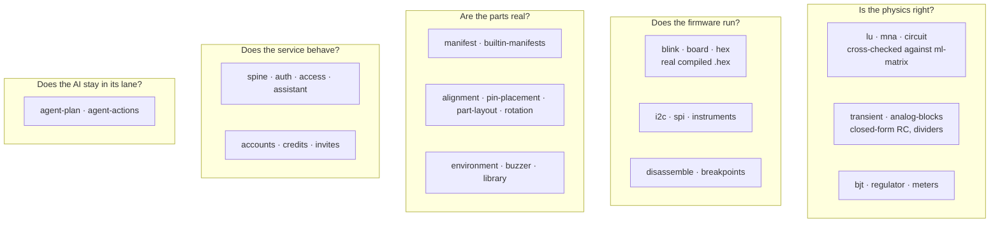

# Testing

**1202 tests across 45 files**, all of them run by `npm test`. The engine has no DOM dependency, so
almost all of it runs headless in Node — which is why the suite is fast enough to run on every
change.

```bash
npm test          # everything
npm run typecheck # build the packages, then the tests, then the app
npm run verify    # typecheck + test + bench
npm run bench     # excluded from the normal run — see below
```

Postgres and Redis are brought up in containers for the run and taken away afterwards
(`test/containers.ts`). Suites that need them **skip** when Docker is unavailable rather than
failing, so a checkout without Docker still gives a useful answer.

## What each suite is guarding



## The kinds of test, and why each exists

**Against a closed form.** Resistive dividers, RC time constants (`v(τ) = 0.632·V`), diode
operating points. Every solver result is also checked against `ml-matrix`'s LU on the same system,
so a battle-tested library guards the hand-rolled one without being in the hot path.

**Against real compiled firmware.** `blink.test.ts` runs an actual `.hex` produced by `arduino-cli`
and asserts D13 toggles at 1 Hz. Fixtures are built by `npm run fixtures:build`. This is the test
that proves the spine — a CPU core, a pin model and a solver that agree with each other.

**Against real Postgres, concurrently.** The invite and credit races are tested by issuing genuinely
simultaneous requests, not by mocking a transaction. Two racing redemptions must reward once; two
racing confirmations must pay once. A mock would have agreed with the bug.

**Against the datasheet.** `builtin-manifests.test.ts` holds all 48 manifests to their own stated
limits, and `pin-placement.test.ts` checks every part's geometry — pins inside the body, neighbours
exactly one pitch apart, the cluster centred to within half a pitch. Both exist because a bug got
through: parts whose pins sat in a corner of their own body.

**Against the canvas.** `alignment.test.ts` compares two independently computed positions — where a
part's leg is, and where the hole it is wired to is — for every example project. A wire can be
electrically correct and visually wrong, and that reads as a rendering bug and destroys trust in
everything else on screen.

**Against the model.** `agent-plan.test.ts` is a set of plans that read perfectly and are wrong: a
pin that does not exist, a duplicate id, a wire with both ends on one terminal. The failure worth
guarding is not a refusal, it is a plausible plan applied without complaint.

## Benchmarks

Run separately, by `npm run bench`, and excluded from `npm test` on purpose: Vitest runs files in
parallel, so a wall-clock assertion competing with eleven other files measures CPU contention
rather than the solver. The same benchmark read 0.81× under load and 2.05× alone.

## Live tests

`npm run test:live` calls the real Gemini API and needs a key in `.env`. Not part of the normal
run — it costs money and needs the network. It exists because agent mode was verified against the
real model, not a fixture: asked to fix an LED drawing 78 mA, it produced remove-LED, add 220 Ω,
re-add, rewire. That plan became a test.

## Writing one

Tests live in `<package>/test/`. Two conventions worth keeping:

- **The comment says what broke.** Most of these tests exist because something was wrong; the
  header records what, so nobody deletes the test for looking obvious.
- **Prove the test fails first.** Several of these caught nothing when written. Revert the fix, run
  the test, watch it fail, restore. It takes a minute and it is the difference between a test and
  a decoration.
